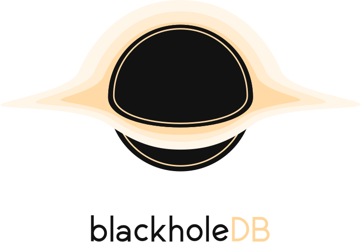

<p align="center">
  
</p>

# Black Hole DB
BlackHoleDB (or only HoleDB) is a concept of Key-Value distributed Database.
HoleDB uses  as decentralized filesystem, 
and  for store the local key value pairs.

## How Works
BlackHoleDB create an encrypted file into IPFS filesystem and this return an Qm name (the decentralized path), 
this Qm path is saved into BadgerDB instance as value where the key is the initial key choose. When you want get your 
value from the distributed web BlackHoleDB get the Qm linked your key (from BadgerDB) and with this Qm path HoleDB gets
the encrypted file from IPFS and finally it decrypted it.

```go
key := "answer"

err = db.Set(key, []byte("Hello World, from BlackHoleDB"))
if err != nil {
	panic(err)
}

data, err := db.Get(key)
if err != nil {
	panic(err)
}

fmt.Println("Answer: ", string(data))
// Answer: Hello World, from BlackHoleDB

```  